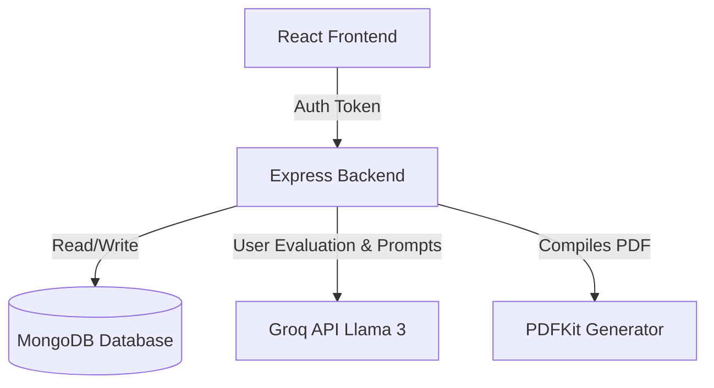

# AI Adaptive Certification Assessment Platform (CHIMERA / C³AB CERTIFY)

An advanced, AI-powered adaptive technical certification and assessment platform built on the MERN stack (MongoDB, Express, React, Node.js), integrating the Groq Cloud API for dynamic assessment generation, evaluation, and comprehensive capability profiling.

---

## 🏗️ Architectural Overview

The application is structured as a decoupled monorepo:

*   **`backend/`**: Express REST API, Mongoose schemas, AI interfaces, and PDF generation scripts.
*   **`frontend/`**: Single Page Application built on React, Vite, Tailwind CSS, and Recharts.

---

## 🌟 Key Features & Implementation Logic

### 1. Adaptive AI Question Generation
*   **Trigger**: Candidate initiates assessment from the dashboard by submitting details: Job Role, Target Certification Level (`Beginner`, `Intermediate`, `Advanced`), Experience, and Core Skills.
*   **Logic**: The backend issues a structural prompt to the Groq API utilizing the `llama-3.3-70b-versatile` model via [groq.service.js](file:///c:/Users/Kamal/Certifications/AI-Certification-Platform/backend/services/groq.service.js).
*   **Output**: Returns 20 customized, non-repetitive questions covering multiple formats:
    *   **Multiple-Choice (MCQ)** and **Multiple-Selection (MSQ)**
    *   **Short Answer**, **Long Answer**, **Scenario-Based**, **Logical Reasoning**, and **Analytical Thinking**.
*   **Fallback**: An automated mock generator handles requests dynamically if the API keys are not specified.

### 2. Assessment Proctoring & Security Safeguards
*   **Tab Switching Detection**: Tracks page visibility events and browser exit-fullscreen signals.
*   **Violation Logging**: Saves events into the database via the `/api/assessments/:id/cheat` endpoint.
*   **Automatic Termination**: If 3 or more cheating/tampering incidents are logged during a session, the attempt is immediately set to `terminated` and permanently invalidated, routing the user to the [DisqualifiedView](file:///c:/Users/Kamal/Certifications/AI-Certification-Platform/frontend/src/pages/Assessment/components/DisqualifiedView.jsx).

### 3. Dual-Evaluation Engine (Exact Match + AI Grading)
*   **Standard Questions**: Auto-grades MCQ (exact string matching) and MSQ (partial credit calculation matching multi-option selection arrays).
*   **Descriptive Questions**: Passively invokes Groq's LLM to evaluate text answers against the question's model rubrics, assigning a score (0–100) and structured grading feedback.
*   **Compilation**: [report.service.js](file:///c:/Users/Kamal/Certifications/AI-Certification-Platform/backend/services/report.service.js) aggregates marks, computes topic-wise averages, and maps skill achievements.

### 4. Custom Remediation & Study Pathways
*   For assessments scoring below the 70% passing threshold, the AI agent dynamically generates a custom learning path.
*   Maps resources, documentation links, and book suggestions corresponding directly to the candidate's lowest-scoring topics.

### 5. Document Generation & Digital Credentials
*   **PDF Export**: Converts certificate records to high-quality PDF files via [pdf.service.js](file:///c:/Users/Kamal/Certifications/AI-Certification-Platform/backend/services/pdf.service.js).
*   **Layout**:
    *   *Page 1*: Landscape A4 certificate with custom orange/gold decorative ribbons, CTO signature, and verification QR code.
    *   *Page 2+*: Portrait A4 technical performance report complete with score bars, competency analytics, AI feedback cards, strengths/weaknesses grids, and recommendations.
*   **Public Verification**: The embedded QR code points to the `/verify/:hash` route, which invokes `/api/certificates/verify/:hash` to validate authenticity.

---

## 🗄️ Database Schemas (Mongoose Models)

All database models reside in [backend/models/](file:///c:/Users/Kamal/Certifications/AI-Certification-Platform/backend/models/):

1.  **[User.js](file:///c:/Users/Kamal/Certifications/AI-Certification-Platform/backend/models/User.js)**: Candidate name, email, credentials, and date of registration.
2.  **[Assessment.js](file:///c:/Users/Kamal/Certifications/AI-Certification-Platform/backend/models/Assessment.js)**: Tracks state (`setup`, `active`, `completed`, `terminated`), user profile parameters, and proctoring metrics.
3.  **[Question.js](file:///c:/Users/Kamal/Certifications/AI-Certification-Platform/backend/models/Question.js)**: Custom generated question text, type, options array, timer duration, and ideal answers/rubrics.
4.  **[Answer.js](file:///c:/Users/Kamal/Certifications/AI-Certification-Platform/backend/models/Answer.js)**: Stores candidate response, duration taken, timeout markers, and detailed AI grading results.
5.  **[CheatingLog.js](file:///c:/Users/Kamal/Certifications/AI-Certification-Platform/backend/models/CheatingLog.js)**: Log records of security violations (e.g. fullscreen exits, blur).
6.  **[Report.js](file:///c:/Users/Kamal/Certifications/AI-Certification-Platform/backend/models/Report.js)**: Performance summaries, overall metrics, topic-wise aggregates, skill gap status, and study guides.
7.  **[Certificate.js](file:///c:/Users/Kamal/Certifications/AI-Certification-Platform/backend/models/Certificate.js)**: Issuance ID, verification hashes, scores, levels, and expiry terms.

---

## 🗺️ Codebase Navigation Map

### 💻 Backend Services & Routes
*   **Entry Point**: [server.js](file:///c:/Users/Kamal/Certifications/AI-Certification-Platform/backend/server.js) starts the Express application on port `5000`.
*   **Routing Hub**: [app.js](file:///c:/Users/Kamal/Certifications/AI-Certification-Platform/backend/app.js) mounts middlewares and maps API controllers:
    *   `/api/auth` -> [auth.routes.js](file:///c:/Users/Kamal/Certifications/AI-Certification-Platform/backend/routes/auth.routes.js)
    *   `/api/assessments` -> [assessment.routes.js](file:///c:/Users/Kamal/Certifications/AI-Certification-Platform/backend/routes/assessment.routes.js)
    *   `/api/certificates` -> [certificate.routes.js](file:///c:/Users/Kamal/Certifications/AI-Certification-Platform/backend/routes/certificate.routes.js)
    *   `/api/reports` -> [report.routes.js](file:///c:/Users/Kamal/Certifications/AI-Certification-Platform/backend/routes/report.routes.js)
*   **Security Context**: [auth.middleware.js](file:///c:/Users/Kamal/Certifications/AI-Certification-Platform/backend/middleware/auth.middleware.js) intercepts header tokens, authenticating API queries.

### 🎨 Frontend Pages & Views
All routes are routed via [AppRoutes.jsx](file:///c:/Users/Kamal/Certifications/AI-Certification-Platform/frontend/src/routes/AppRoutes.jsx):

*   **`/dashboard`**: Lists historical attempts, certification records, and triggers new assessments.
*   **`/assessment`**: Renders the fullscreen proctored test platform, timing indicators, progress logs, and cheating warnings.
*   **`/results/:id`**: Renders performance charts, AI recommendations, and certificate mock previews.
*   **`/verify/:hash`**: Public endpoint validating certificate credentials and authenticity signatures.
